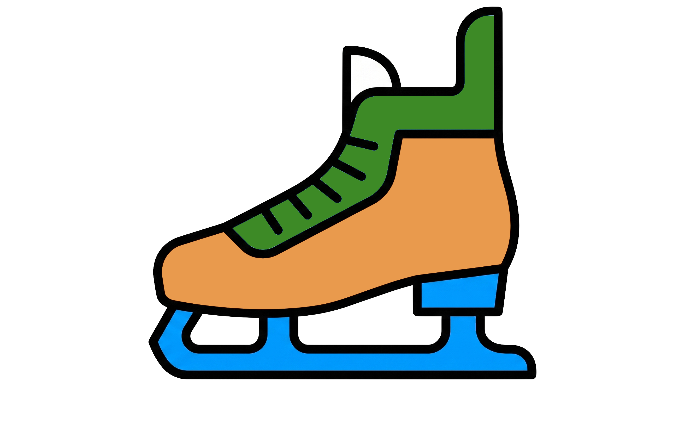

<p align="center">
  
</p>

# skeights

Serialize fitted scikit-learn models to [safetensors](https://github.com/huggingface/safetensors) + JSON.

No pickle. No joblib. Just weights and config.

## Why?

Pickle is the default way to save sklearn models, but it's insecure
(arbitrary code execution on load), fragile (breaks across versions),
and opaque (you can't inspect what's inside without loading it).

skeights splits a model into two layers:

- **`.json`**: hyperparameters, fitted scalars, and structural config.
  Human-readable, greppable, diffable. You can inspect how a model
  is configured without deserializing it or running any code.
- **`.safetensors`**: the numeric bulk (coefficients, tree split
  arrays, leaf values) as dense typed arrays in the
  [safetensors](https://github.com/huggingface/safetensors) format.
  Typed binary arrays instead of numbers encoded as text, which
  matters most for large tree ensembles.

Why safetensors specifically: it is memory-mappable,
language-agnostic, and widely adopted across the ML ecosystem. The
weight payload is readable outside Python and outside skeights.
Loading safetensors does not execute arbitrary code.

!!! note
    skeights does not use pickle or joblib. The JSON state file specifies
    the Python classes to instantiate (e.g. `sklearn.linear_model.Ridge`),
    but the loader only allows imports from `sklearn`, `lightgbm`, and
    `xgboost`. Arbitrary module imports from crafted JSON files are blocked.

## Quick start

```bash
pip install skeights
```

```python
import skeights

# Save a fitted model
skeights.save(model, "model.safetensors", "model.json")

# Load and predict
loaded = skeights.load("model.safetensors", "model.json")
predictions = loaded.predict(X_test)
```

See the [Getting Started](guide/getting-started.md) guide for full examples including pipelines, in-memory serialization, and hyperparameter inspection.
